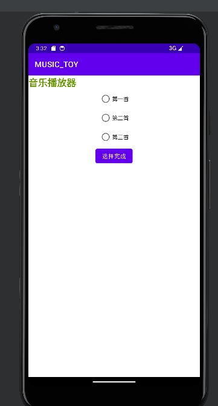

# 简单音乐播放器-第一弹

[toc]

## 简单功能目标

在第一个页面有可选的歌曲名称，和确定选择按键

功能：页面选择歌曲按确定选择键，会跳转到该音乐的播放界面，有开始播放，暂停和继续播放功能，有停止播放按钮可以停止播放，停止播放后自动跳回原界面。播放时唱片有旋转的功能，暂停时选择动画效果暂停。

## 界面设计

### 菜单界面

主要由RadioGroup，TextView和button组件构成，布局采用LinearLayout布局

效果：



### 音乐播放时的页面

我们的设计目标：

首先上述组件以线性水平排放

```xml
<?xml version="1.0" encoding="utf-8"?>
<LinearLayout xmlns:android="http://schemas.android.com/apk/res/android"
    xmlns:tools="http://schemas.android.com/tools"
    android:layout_width="match_parent"
    android:layout_height="match_parent"
    android:background=""
    tools:context=".music_play"
    android:gravity="center"
    android:orientation="vertical">
</LinearLayout>
```

首先声明命名空间

**android:layout_width="match_parent" android:layout_height="match_parent"**：这两个属性设置了`LinearLayout`的宽度和高度，使其充满父容器。

**tools:context=".music_play"** 关联该布局的activity类名

**android:gravity="center"**：

- 这设置了`LinearLayout`的内容在垂直方向上的对齐方式，使其内容在垂直方向上居中。

**android:orientation="vertical"**：

- 这设置了`LinearLayout`的子视图排列方向为垂直。即，子视图将按照垂直方向进行排列。

image下方布置一个text来表示歌名

```xml
    <TextView
        android:id="@+id/song_name"
        android:layout_width="wrap_content"
        android:layout_height="wrap_content"
        android:text="歌曲名"
        android:textSize="20sp"/>
```

接下来添加imageview组件

```xml
    <ImageView
        android:id="@+id/iv_music"
        android:layout_width="240dp"
        android:layout_height="240dp"
        android:layout_gravity="center_horizontal"
        android:layout_margin="15dp"
        android:src="@drawable/bgc1" />
```

设置播放进度条

```xml
<SeekBar
        android:id="@+id/sb"
        android:layout_width="match_parent"
        android:layout_height="wrap_content" />
```

设置进度条的时间长度，这个组件包两个textview

```xml
<RelativeLayout
        android:layout_width="match_parent"
        android:layout_height="wrap_content"
        android:paddingLeft="8dp"
        android:paddingRight="8dp">
        <TextView
            android:id="@+id/tv_progress"
            android:layout_width="wrap_content"
            android:layout_height="wrap_content"
            android:layout_alignParentRight="false"
            android:text="00:00"/>
        <TextView
            android:id="@+id/tv_total"
            android:layout_width="wrap_content"
            android:layout_height="wrap_content"
            android:layout_alignParentRight="true"
            android:text="00:00"/>
    </RelativeLayout>
```

设置按钮：

开始播放，暂停播放，停止播放

```xml
        <Button
            android:id="@+id/btn_start"
            android:layout_width="0dp"
            android:layout_height="40dp"
            android:layout_margin="8dp"
            android:layout_weight="1"
            android:background="@color/purple_500"
            android:text="开始播放"/>
        <Button
            android:id="@+id/btn_pause"
            android:layout_width="0dp"
            android:layout_height="40dp"
            android:layout_margin="8dp"
            android:layout_weight="1"
            android:background="@color/purple_500"
            android:text="暂停播放"/>

        <Button
            android:id="@+id/btn_exit"
            android:layout_width="0dp"
            android:layout_height="40dp"
            android:layout_margin="8dp"
            android:layout_weight="1"
            android:background="@color/purple_500"
            android:text="停止播放" />
```

界面效果：


## 后端设计

### 音乐选择界面

我们的功能和按键有关，所以需要实现View.OnClickListener接口，继承`AppCompatActivity` 类，其本质上是 `Activity` 类的一个子类，但它包含了一些额外的功能，使得开发者更容易适配新的 Android 特性，并能够在旧版本上运行应用

因为OnClickListener里面有抽象方法，所以这个类如果不是虚类就必须要实现这里的虚方法onClick

```java
@Override
    public void onClick(View v) {}
```

通过按键监听确定选择的歌曲，使用intent跳转到相应的页面，将所选歌曲的名字和顺序通过intent传递

```java
        public void onClick(View v) {
            Log.d(TAG, "click");
            finishBtn.setOnClickListener(v1 -> {
                if (r1.isChecked()) {

                    Intent intent=new Intent(MainActivity.this,music_play.class);
                    //显示调用ResultActivity
                    intent.putExtra("name",name[0]);
                    intent.putExtra("position",String.valueOf(0));
                    startActivity(intent);

                }
                if (r2.isChecked()) {
                    Intent intent=new Intent(MainActivity.this,music_play.class);
                    //显示调用ResultActivity
                    intent.putExtra("name",name[1]);
                    intent.putExtra("position",String.valueOf(1));

                    startActivity(intent);
                }
                if (r3.isChecked()) {
                    Intent intent=new Intent(MainActivity.this,music_play.class);
                    //显示调用ResultActivity
                    intent.putExtra("name",name[2]);
                    intent.putExtra("position",String.valueOf(2));

                    startActivity(intent);
                }
                
            });
```

###  音乐播放界面

初始化，设置按键的ID和动画效果的初始化，根据intent传回的参数设置播放时的图片和歌曲名称，目前进度条相关控制程序还没有实现

```java
    private void init(){
        isplaying=false;
    //绑定ID
        tv_progress=(TextView)findViewById(R.id.tv_progress);
        tv_total=(TextView)findViewById(R.id.tv_total);
        sb=(SeekBar) findViewById(R.id.sb);
       song_name=(TextView) findViewById(R.id.song_name);

       findViewById(R.id.btn_pause).setOnClickListener(this);
       findViewById(R.id.btn_start).setOnClickListener(this);
       findViewById(R.id.btn_exit).setOnClickListener(this);

       name=intent1.getStringExtra("name");
       song_name.setText(name);

        //为滑动条添加事件监听
        sb.setOnSeekBarChangeListener(new SeekBar.OnSeekBarChangeListener() {
            @RequiresApi(api = Build.VERSION_CODES.KITKAT)
            @Override
            public void onProgressChanged(SeekBar seekBar, int progress, boolean fromUser) {
                //进度条改变时，会调用此方法
                if (progress==seekBar.getMax()){//当滑动条到末端时，结束动画
                    animator.pause();//停止播放动画
                }
            }
            @Override
            public void onStartTrackingTouch(SeekBar seekBar) {//滑动条开始滑动时调用
            }
            @Override
            public void onStopTrackingTouch(SeekBar seekBar) {//滑动条停止滑动时调用
                //根据拖动的进度改变音乐播放进度
                //int progress=seekBar.getProgress();//获取seekBar的进度
            }
        });
       //设置图片和图片旋转效果
        ImageView iv_music=(ImageView)findViewById(R.id.iv_music);
        String position= intent1.getStringExtra("position");
        int i=parseInt(position);
        iv_music.setImageResource(icons[i]);


        animator=ObjectAnimator.ofFloat(iv_music,"rotation",0f,360.0f);
        animator.setDuration(10000);//动画旋转一周的时间为10秒
        animator.setInterpolator(new LinearInterpolator());//匀速
        animator.setRepeatCount(-1);//-1表示设置动画无限循环

    }

```

对界面的按键控制进行设置，根据intent传回的参数设置播放的歌曲，设置开始播放功能和暂停功能的按键的控制逻辑。停止播放后调用intent返回主菜单界面。

```java
  @Override
    public void onClick(View v) {
        String position;
        int i;
        if(v.getId()==R.id.btn_start){
            position=intent1.getStringExtra("position");
            i=parseInt(position);
            if (mplayer != null && isplaying) {
                mplayer.release();
                mplayer.reset();
            }
            mplayer = MediaPlayer.create(this, musics[i]);
            Toast.makeText(this, "播放开始！", Toast.LENGTH_SHORT).show();
            mplayer.start();
            animator.start();
        }
        else if(v.getId()==R.id.btn_pause){
            if ( mplayer !=null&&isplaying) {
                Toast.makeText(this, "播放暂停！", Toast.LENGTH_SHORT).show();
                mplayer.pause();
                isplaying=false;
                animator.pause();
            }
            else{
                Toast.makeText(this, "播放继续！", Toast.LENGTH_SHORT).show();
                mplayer.start();
                isplaying=true;
                animator.start();
            }
        }
        else if(v.getId()==R.id.btn_exit){
            mplayer.release();
            Toast.makeText(this, "播放停止！", Toast.LENGTH_SHORT).show();
            intent2=new Intent(this,MainActivity.class);
            startActivity(intent2);
        }

        if(mplayer != null && isplaying)
        mplayer.setOnCompletionListener(mplayer -> {
            mplayer.release();
            Toast.makeText(this, "播放结束！", Toast.LENGTH_SHORT).show();
            isplaying = false;
        });
    }

```

